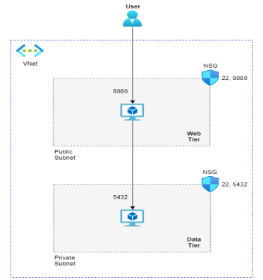

# Terraform Setup Guide

This guide provides step-by-step instructions on setting up a Terraform project to deploy your infrastructure. Terraform is an infrastructure as code tool that allows you to define and provision resources in various cloud platforms.

## Prerequisites

Before getting started, ensure you have the following prerequisites installed on your system:

1. [Terraform](https://www.terraform.io/downloads.html) - Download and install Terraform based on your operating system.
2. Access credentials to your cloud provider (Azure).

## Steps

Follow these steps to set up your Terraform project:


### 1. Initialize Terraform

Run the `terraform init` command to initialize Terraform in the project directory. This step downloads any necessary plugins and modules.

```bash
terraform init
```

### 2. Create `terraform.tfvars` File

Create a file named `terraform.tfvars` in the project directory. This file will hold sensitive information and variable values required for your infrastructure. Add the following variables and their corresponding values to this file:

```hcl
secret_key_py = "your_secret_key_here"
web_password = "your_web_password_here"
db_password = "your_db_password_here"
postgresql_password = "your_postgresql_password_here"
my_ip = "your_public_ip_here"
```

Please replace `your_secret_key_here`, `your_web_password_here`, `your_db_password_here`, `your_postgresql_password_here`, and `your_public_ip_here` with your actual secret keys and passwords.

**Note:** Ensure that you keep this file secure and do not share it publicly.

### 3. Terraform Apply

Now you can apply your Terraform configuration to create the infrastructure based on your defined resources. Run the following command:

```bash
terraform apply
```

Terraform will display a summary of the changes it will make to your infrastructure. Confirm by typing `yes` when prompted. The process may take some time depending on your configuration complexity.

## Diagram

Here's a diagram illustrating the architecture of the project:



## Cleanup

To clean up the resources created by Terraform, use the `terraform destroy` command:

```bash
terraform destroy
```

Terraform will prompt you to confirm the destruction of all resources. Type `yes` to proceed with the cleanup. Be cautious as this action cannot be undone, and all your resources will be removed.

## Conclusion

Congratulations! You've set up your Terraform project and deployed your infrastructure using code. Remember to keep your `terraform.tfvars` file safe and avoid sharing sensitive information with others. Always review your Terraform plans carefully before applying them to avoid unintended changes to your infrastructure. Happy coding!
